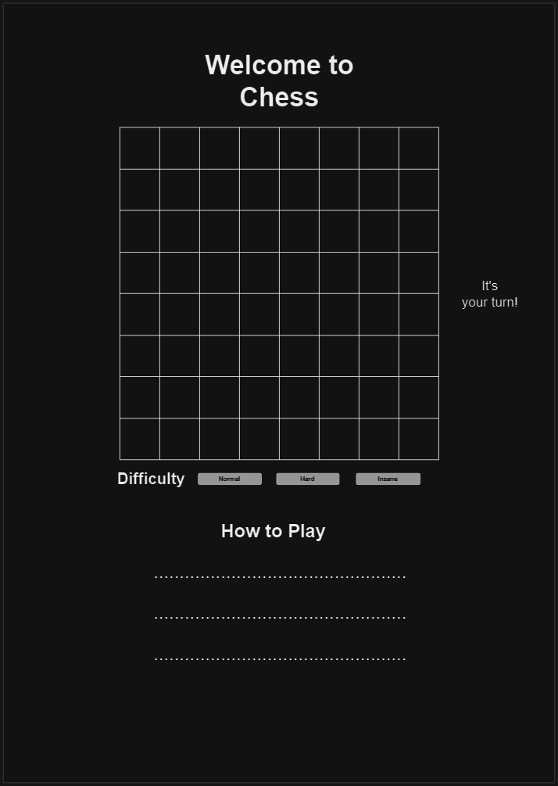

## Chess game

---

## Intorduction

The Chess Game project is designed to provide an engaging, interactive, and user-friendly experience for chess enthusiasts. The game follows the traditional rules of chess, allowing players to move pieces according to the game's established rules. The application is developed using modern web technologies like HTML, CSS, and JavaScript to ensure it runs smoothly on various browsers and devices.

This project also serves as a learning experience in building front-end web applications, particularly focusing on interactivity, game logic, and responsive design.

---

## Project Overview

This project is a fully interactive web-based chess game built using HTML, CSS, and JavaScript. The game allows two players to play a standard game of chess with turn-based interaction. It features accurate chess movement rules, the ability to restart games, and plans for additional enhancements like checkmate detection and AI opponent integration.

---

## Contents

- [User Experience (UX)](#user-experience-ux)
- [Design](#design)
  - [Wireframes](#wireframes)
- [Features](#features)
- [Technologies Used](#technologies-used)
- [Testing](#testing)

---

## User Experience

---

## Design

### Wireframes

Basic concept of the website layout:

---

## Features

Over the next few days, the following features will be developed to ensure a fully functional and engaging chess experience:

- Interactive Chessboard: A fully interactive chessboard where players can click and move pieces according to standard chess rules.
- Turn-based Play: The game automatically alternates between white and black players after each move.
- Move Validation: The game validates pawn movement to ensure it follows the correct chess rules. Other pieces' validation is under development.
- Game Restart: Players can reset the game and start over at any time by pressing the restart button.
- Undo Move: An undo feature allows players to revert their last move, giving them flexibility in gameplay.
- Visual Feedback: Selected pieces and valid moves are highlighted to enhance the user experience.

---

## Technologies Used

---

## Testing

I have created a separate file dedicated solely to testing, as the comprehensive details would be too lengthy for this README. Please feel free to review the full testing documentation in the following section:

[text](assets/test/testing.md)

---
