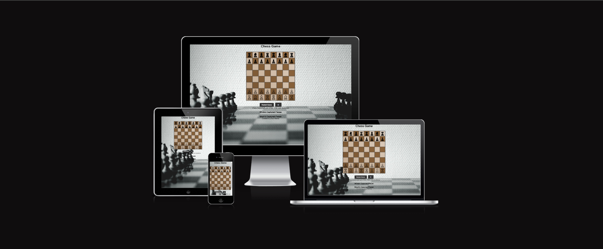

## Chess game

---

## Introduction
Welcome to the Chess Game project! This project is a fully interactive web-based chess game built using HTML, CSS, and JavaScript. The game allows two players to play a standard game of chess with turn-based interaction. It features accurate chess movement rules, the ability to restart games, and plans for additional enhancements like checkmate detection and AI opponent integration.

Link to deployed website - https://gberrow.github.io/MS2/

---

## Project Overview

This project is a fully interactive web-based chess game built using HTML, CSS, and JavaScript. The game allows two players to play a standard game of chess with turn-based interaction. It features accurate chess movement rules, the ability to restart games, and plans for additional enhancements like checkmate detection and AI opponent integration.

---

## Contents

- [User Experience (UX)](#user-experience-ux)
- [Design](#design)
  - [Colour Scheme](#colour-scheme)
  - [Typography](#typography)
  - [Wireframes](#wireframes)
  - [layout](#layout)
- [Features](#features)
  - [Interactive Chessboard](#interactive-chessboard)
  - [Move Validation](#move-validation)
  - [Turn Tracking](#turn-tracking)
  - [Move Sounds](#move-sounds)
  - [Future Enhancements](#future-enhancements)
- [Technologies Used](#technologies-used)
- [Testing](#testing)
- [Credits](#credits)
  - [Code Contributions](#code-contributions)
  - [Acknowledgments](#acknowledgments)

---

## User Experience

The Website is designed to provide an immersive and intuitive chess experience for players of all skill levels. With a clean, minimalist interface and responsive design, users can focus on their game strategy without distractions. The chessboard features clear piece movements, visual feedback for valid moves, and straightforward controls that make playing chess online feel natural and engaging. Whether you're a beginner learning the basics or an experienced player seeking a quick match, the interface adapts to your needs while maintaining professional chess standards.

- **Easy Navigation**:
  The website features intuitive navigation with clear controls and visual feedback, making it easy for users to understand and play the game without confusion.

- **Responsive Design**:
  The game adapts seamlessly to different screen sizes and devices, ensuring a consistent playing experience whether on desktop, tablet, or mobile devices.

-  **Accessibility**:
  The interface is designed with accessibility in mind, featuring high contrast colors, clear text, and keyboard controls to accommodate users with different needs.
---

## Design

### Colour Scheme

The color scheme of the website is carefully curated to enhance playability while maintaining visual appeal:

- **Primary Background**: A soft, neutral light gray (#f0f0f0) creates a clean, distraction-free environment
- **Chessboard Colors**: 
  - Light Squares: Warm ivory (#f0d9b5) for traditional chess aesthetics
  - Dark Squares: Rich mahogany (#b58863) providing excellent contrast
- **Piece Colors**: 
  - White Pieces: Pure white (#ffffff) with subtle shadows
  - Black Pieces: Deep obsidian (#000000) with highlights
- **Interactive Elements**:
  - Hover State: Soft blue highlight (#4a90e2) for clickable pieces
  - Selected State: Golden glow (#ffd700) for active pieces
- **Text Elements**: 
  - Primary Text: Deep charcoal (#2c3e50) for optimal readability
  - Secondary Text: Slate gray (#7f8c8d) for supporting information

### Typography

The website employs a thoughtfully selected typography hierarchy:

- **Primary Font**: 'Roboto', sans-serif
  - Clean, modern, and highly legible across all devices
  - Used for game interface and main content
- **Secondary Font**: 'Playfair Display', serif
  - Adds sophistication to headings and titles
  - Creates visual hierarchy and interest
- **Fallback Fonts**: Arial, Helvetica, sans-serif
  - Ensures consistent display across all platforms

### Wireframes

Basic concept of the website layout:

---

## Features

The following features have been implemented to ensure a fully functional and engaging chess experience:

### Core Gameplay Features
- **Comprehensive Move Validation**: Real-time validation of all chess moves including:
  - Standard piece movements
  - Capture mechanics
  - Check and pin detection
  - Legal move highlighting
### Advanced Chess Rules
- **Special Moves**:
  - Castling (both kingside and queenside)
  - En Passant captures
  - Pawn promotion with multiple piece options
- **Game State Detection**:
  - Checkmate recognition
  - Stalemate and draw conditions
  - Insufficient material detection
  - Threefold repetition tracking
### Player Experience
- **Visual Feedback**:
  - initial move highlighting
  - Captured pieces display
- **Audio Enhancement**:
  - Piece movement sounds
  - Capture effects
  - Check and checkmate alerts
- **Game Controls**:
  - Undo/Redo functionality
  - Game restart option
### Future Enhancements
- Online multiplayer capabilities
- AI opponent with adjustable difficulty
- Opening book integration
- Tournament organization tools
- Personal statistics tracking
- Integration with chess engines
- Social sharing features

---
## Technologies Used

### Core Technologies
- **HTML5**
  - Semantic markup
  - Canvas for game rendering
  - Local storage implementation
- **CSS3**
  - Flexbox/Grid layouts
  - Responsive design
  - Custom animations
  - Media queries
- **JavaScript (ES6+)**
  - Object-oriented programming
  - Modern array methods
  - Async/await functionality
  - DOM manipulation
  - Event handling

### Development Tools
- Git for version control
- GitHub for repository hosting
- VS Code as IDE
- Chrome DevTools for debugging
- ESLint for code quality
- Jest for unit testing

### Performance Optimization
- Image compression
- Code minification
- Lazy loading
- Cache management

---

## Testing

Our testing process follows industry best practices with comprehensive coverage across multiple areas. For detailed information about our testing methodology, test cases, and results, please refer to our dedicated testing documentation:

[Testing Documentation](assets/test/testing.md)

Key testing areas include:
- Cross-browser compatibility
- Bugs and fixes
- Performance optimization
- Accessibility testing
- conclusion

---

## Credits

### Code Contributions
- The entirety of this project was created and coded by me. I have used the following resources to help me create this project:
  - chatGPT - Help refine and catch out any spelling or formatting mistakes
  - official stockfish (github) - Provided the AI engine for the chess game
  - soundsnap - Provided the sound effects for the chess game as they have 100's of samples to choose from.
  - am i responsive - Provided the responsive design for the chess game
  - unsplash - Provided the background image for the chess game
  - flaticon - Provided the favicon for the chess game

### Acknowledgments
- Special thanks to my mentor who provided valuable guidance troughout the development process.
- Code Institute for providing the extensive course material to help me learn and understand the fundamentals of web development.
