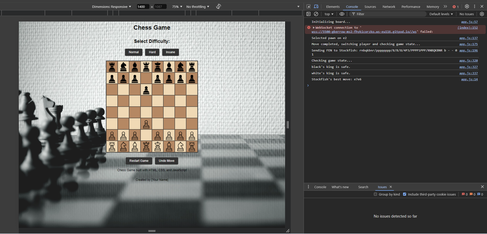
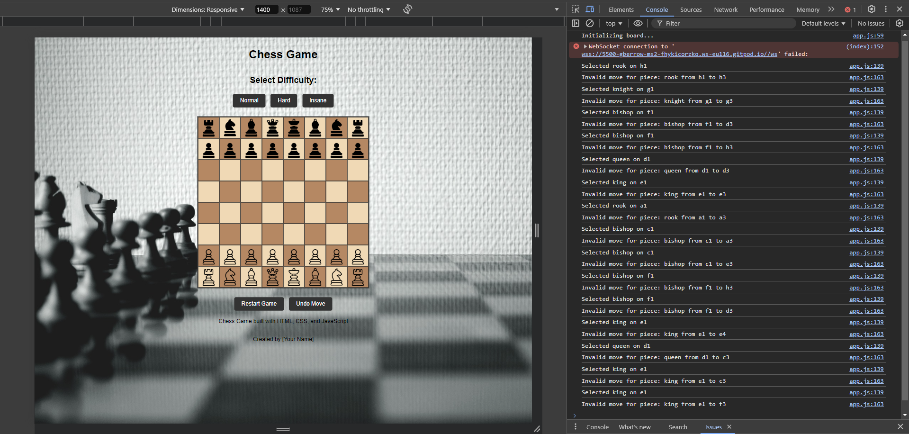
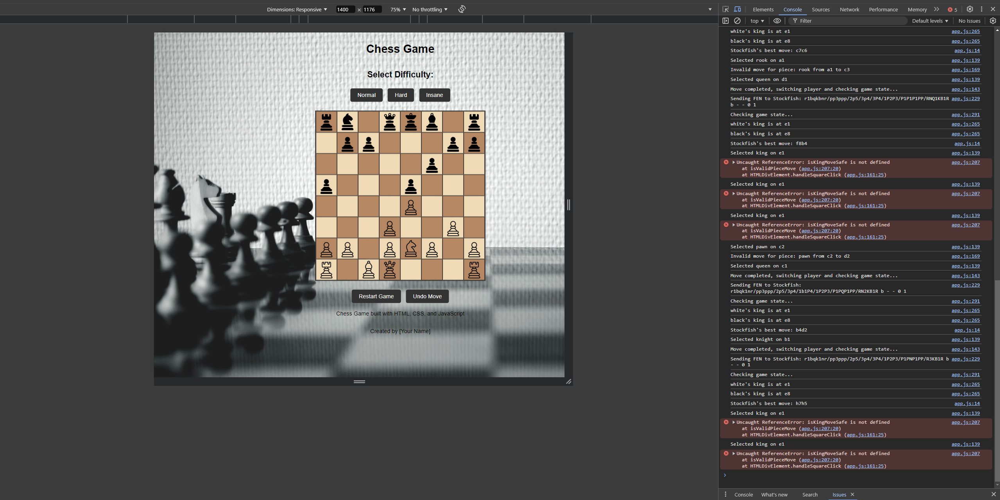

If you want to return to my normal readme, please click the link below:

[readme](../../README.md)

---

- [Testing](#testing)
  - [Full Device and Browser Testing](#full-device-and-browser-testing)
  - [Mobile Responsiveness Testing](#mobile-responsiveness-testing)
  - [Cross Browser Console Output Testing](#cross-browser-console-output-testing)
  - [Edge Case Testing](#edge-case-testing)
  - [Broken Links Testing](#broken-links-testing)
  - [Performance Testing](#performance-testing)
  - [Accessibility Testing](#accessibility-testing)
  - [Security Testing](#security-testing)
  - [User Experience (UX) Testing](#user-experience-ux-testing)
  - [Visual Regression Testing](#visual-regression-testing)
  - [Automated Testing](#automated-testing)
  - [Manual Testing](#manual-testing)
  - [Bugs](#bugs)
  - [Conclusion](#conclusion)

---

## Bugs

---

### 02/10/2024

- **Problem**: AI not responding after the initial move with the white piece.
- **Fix**: The issue was caused by incorrect handling of WebAssembly (WASM) files and miscommunication with Stockfish. The following steps were taken:

  1. Verified both the JavaScript wrapper (`stockfish-16.1-lite-single.js`) and WebAssembly file (`stockfish-16.1-lite-single.wasm`) were correctly placed in the `assets/js/` folder.
  2. Updated the initialization of the Web Worker to point to the JavaScript file:
     ```javascript
     const stockfish = new Worker("assets/js/stockfish-16.1-lite-single.js");
     ```
  3. Confirmed `.wasm` file loading via the Network tab and ensured the MIME type for `.wasm` was `application/wasm`.
  4. After correcting the Worker initialization, the AI responded as expected.

---

### 03/10/2024

- **Problem**: Unable to capture black pieces.
- **Fix**: The game logic was not handling piece capture correctly. Fixes included:

  1. Implemented logic to check if the target square is occupied by an opponent’s piece before a move is completed.
  2. Updated `handleSquareClick` to handle capturing correctly:
     ```javascript
     if (targetSquare.childElementCount > 0) {
       const targetPiece = targetSquare.querySelector(".piece");
       const targetColor = targetPiece.getAttribute("data-color");

       if (targetColor !== selectedPiece.color) {
         targetSquare.removeChild(targetPiece); // Capture opponent's piece
       } else {
         console.log("Cannot move to a square occupied by your own piece.");
         return;
       }
     }
     ```
  3. After this update, white pieces can now capture black pieces, and the game logic proceeds correctly.

---

### 04/10/2024

- **Problem**: No check, checkmate, or draw conditions detected.

  

- **Fix**:
  
  1. **`isKingInCheck`**: Added this function to determine if a player's king is under threat by any opponent's piece.
  2. **`findKing`**: This function locates the player's king for use in threat detection.
  3. **`canPieceAttack`**: Used to validate if a specific opponent piece can attack a target square, using helper functions for different movement types.
  4. **Pawn Attack Fix**: Ensured pawns only attack diagonally upwards (for white) and downwards (for black), preventing false positives.
  5. **`checkGameState`**: This function evaluates the game state after each move to check for check, checkmate, or safe kings.

- **Result**:
  The game now detects when a king is in check. Console logs show whether kings are in check or safe.

  

---

### 07/10/2024

- **Problem**: White pieces were not restricted to their specific movements, complicating debugging.
  
- **Fix**:
  1. **Movement Validation for All Pieces**: 
     - Implemented the `isValidPieceMove` function to validate movement for all pieces.
     - Movement restrictions based on official chess rules:
       - Pawns move forward, attack diagonally.
       - Rooks move horizontally/vertically.
       - Bishops move diagonally.
       - Knights move in an "L" shape.
       - Queens move like both rooks and bishops.
       - Kings move one square in any direction.
     - **Path Clearance Check**: Rooks, bishops, and queens must have a clear path to move. `isPathClear` was added to check this.
  
  2. **`handleSquareClick` Updates**: 
     - `isValidPieceMove` validates moves before they are completed.
     - The game now prevents illegal moves, flags invalid moves, and handles capturing of opponent pieces.
  
  3. **King Safety**:
     - `isKingMoveSafe` prevents the king from moving into positions where it would be in check.

- **Outcome**:
  The game now enforces movement restrictions for all pieces, aligning with chess rules. Debugging is easier as only valid moves are allowed.

  

---

### Next Steps:
- Continue refining movement logic to handle checkmate.

---

### 08/10/2024

- **Problem**:  
   - King cannot move to safety when checked. The game was not validating the king's movement correctly in check situations.



- **Fix**:  
   1. **`isKingMoveSafe` Implementation**:  
      - A new function `isKingMoveSafe` was introduced to check if the king's movement would result in it remaining in check.
      - The function temporarily moves the king to the destination square, checks for any opponent attacks, and then undoes the temporary move.
      - If moving the king would put it in check, the move is declared invalid.
   
   2. **Validation Update**:  
      - The `isValidPieceMove` function was updated to include a call to `isKingMoveSafe` when validating king moves. This ensures that the king's move does not leave it vulnerable to check.

   3. **`checkGameState` Improvements**:  
      - The `checkGameState` function was improved to handle check conditions for both white and black kings.
      - After each move, the game checks if the player's king is in check and logs the results for debugging purposes.
      - Future implementation will handle checkmate conditions.

- **Next Steps**:  
   1. Implement a full checkmate condition by evaluating if there are no valid moves left for the player whose king is in check.

---

### **08/10/2024**

- **Problem**:
- The queen's movement logic was flawed. The queen could only move diagonally, behaving like a bishop, but was unable to move in straight lines (horizontally and vertically).
- The game did not detect when the king was in check after a move, allowing invalid moves.
- Checkmate conditions were not correctly implemented, and the game didn't end when a king was captured.
  


- **Fix**:
1. **Queen Movement Logic**:
   - The `isValidPieceMove` function was corrected for the queen, ensuring that she can move both diagonally like a bishop and in straight lines like a rook. The logic now checks for both `isStraightLineMove` and `isDiagonalMove` with clear path validation.

2. **King Safety Validation**:
   - Introduced the `isKingMoveSafe` function, which temporarily moves the king to the target square and checks if the king would still be in check after the move. This ensures the player cannot move the king into check.

3. **Check & Checkmate Detection**:
   - The `checkGameState` function was enhanced to detect when a player’s king is in check after every move. If a king is in check, the player is forced to make a valid move that removes the check. If no valid moves are available, the game ends in checkmate, calling the `gameOver` function.
   - The game now correctly detects and prevents invalid moves when the player is in check, prompting the player to resolve the check first.

4. **Game Over Condition**:
   - A `gameOver` function was added to handle both checkmate and king capture conditions. Once a king is captured or checkmate occurs, the game ends, and no further moves can be made. A restart button is shown to allow replaying.

---

#### **Next Steps**: