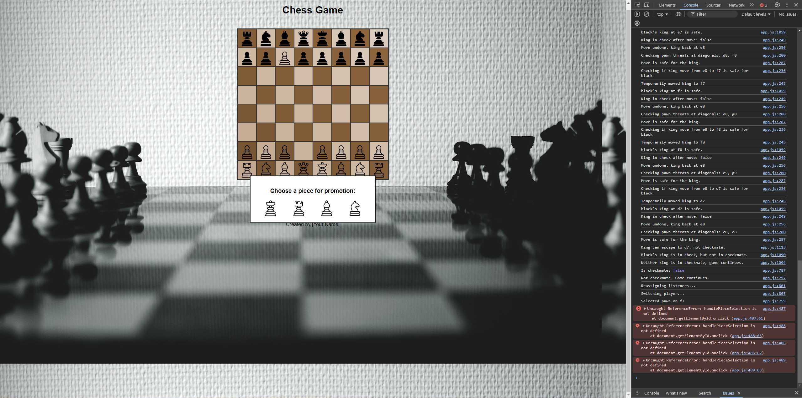

If you want to return to my normal readme, please click the link below:

[Main Page](../../README.md)

---

- [Testing](#testing)
  - [Full Device and Browser Testing](#full-device-and-browser-testing)
  - [Mobile Responsiveness Testing](#mobile-responsiveness-testing)
  - [Cross Browser Console Output Testing](#cross-browser-console-output-testing)
  - [Edge Case Testing](#edge-case-testing)
  - [Broken Links Testing](#broken-links-testing)
  - [Performance Testing](#performance-testing)
  - [Accessibility Testing](#accessibility-testing)
  - [Security Testing](#security-testing)
  - [User Experience (UX) Testing](#user-experience-ux-testing)
  - [Visual Regression Testing](#visual-regression-testing)
  - [Automated Testing](#automated-testing)
  - [Manual Testing](#manual-testing)
  - [Bugs and fixes](#bugs-and-fixes)
  - [Conclusion](#conclusion)


Important!: Sadly I was not able to complete major part of the testing processes (as shown above) due to time constraints and personal issues. Down below is what I have achieved in the development process of the game
---

## Bugs and Fixes

### AI / Stockfish Interaction

---

### **02/10/2024**

- **Problem**: AI not responding after the initial move with the white piece.
- **Fix**: The issue was caused by incorrect handling of WebAssembly (WASM) files and miscommunication with Stockfish. The following steps were taken:
  1. Verified that the `stockfish-16.1-lite-single.js` and `.wasm` files were in the correct folder.
  2. Updated the initialization of the Web Worker:
     ```javascript
     const stockfish = new Worker("assets/js/stockfish-16.1-lite-single.js");
     ```
  3. Ensured `.wasm` loaded with the MIME type `application/wasm`.
  4. After these corrections, the AI responded correctly.

---

### 03/10/2024

- **Problem**: Unable to capture black pieces.
- **Fix**: The game logic was not handling piece capture correctly. Fixes included:

  1. Implemented logic to check if the target square is occupied by an opponent’s piece before a move is completed.
  2. Updated `handleSquareClick` to handle capturing correctly:
     ```javascript
     if (targetSquare.childElementCount > 0) {
       const targetPiece = targetSquare.querySelector(".piece");
       const targetColor = targetPiece.getAttribute("data-color");

       if (targetColor !== selectedPiece.color) {
         targetSquare.removeChild(targetPiece); // Capture opponent's piece
       } else {
         console.log("Cannot move to a square occupied by your own piece.");
         return;
       }
     }
     ```
  3. After this update, white pieces can now capture black pieces, and the game logic proceeds correctly.

---

### Movement Validation

### **04/10/2024**

- **Problem**: White pieces were not restricted to specific movement patterns.

  

 - **Fixes**:
  1. Implemented `isValidPieceMove` for validating movements based on official chess rules.
     - Pawns move forward, attack diagonally.
     - Rooks move horizontally/vertically.
     - Bishops move diagonally.
     - Knights move in an "L" shape.
     - Queens move like both rooks and bishops.
     - Kings move one square in any direction.
     - Path clearance checks for rooks, bishops, and queens using `isPathClear`.
  2. Updated `handleSquareClick` to validate moves before completion, flag illegal moves, and handle piece capturing.
  3. **King Safety**: Added `isKingMoveSafe` to prevent the king from moving into check.

- **Result**: The game now enforces valid movements for all pieces, easing debugging by allowing only legal moves.

  

---

### King Safety and Checkmate Detection

### **07/10/2024**

- **Problem**: No detection for check, checkmate, or draw conditions.
  
- **Fixes**:
  1. **isKingInCheck**: Checks if a player's king is under threat.
  2. **findKing**: Locates the player's king.
  3. **canPieceAttack**: Validates if a specific opponent piece can attack the king.
  4. **Pawn Attack Fix**: Ensured pawns attack diagonally and appropriately detect threats.
  5. **checkGameState**: Evaluates the game state after each move to check for check, checkmate, or safe kings.

- **Result**: The game detects check conditions and updates the state accordingly.

---

### 08/10/2024

- **Problem**:  
   - King cannot move to safety when checked. The game was not validating the king's movement correctly in check situations.


- **Fix**:  
   1. **`isKingMoveSafe` Implementation**:  
      - A new function `isKingMoveSafe` was introduced to check if the king's movement would result in it remaining in check.
      - The function temporarily moves the king to the destination square, checks for any opponent attacks, and then undoes the temporary move.
      - If moving the king would put it in check, the move is declared invalid.
   
   2. **Validation Update**:  
      - The `isValidPieceMove` function was updated to include a call to `isKingMoveSafe` when validating king moves. This ensures that the king's move does not leave it vulnerable to check.

   3. **`checkGameState` Improvements**:  
      - The `checkGameState` function was improved to handle check conditions for both white and black kings.
      - After each move, the game checks if the player's king is in check and logs the results for debugging purposes.
      - Future implementation will handle checkmate conditions.

- **Result**: Illegal king moves are prevented, and checkmate conditions are now detected.

---
### **09/10/2024**

- **Problems Detected**:
  1. **Queen's Movement Logic**: The queen behaved like a bishop, moving only diagonally but not in straight lines.
  2. **King in Check Ignored**: The game did not detect when the king was in check, allowing illegal moves that should not be possible while in check.
  3. **Checkmate Detection**: The game failed to detect checkmate scenarios and continued without declaring the game over when the king had no legal moves.
  4. **Unrestricted Moves While in Check**: Players could continue moving any piece while the king was in check, violating chess rules that restrict moves to resolving the check.
  5. **Pawn Attack on the King Ignored**: Pawn's diagonal attack on the king was not correctly detected, allowing the king to move into positions that should be considered unsafe.
  6. **Game Over Not Triggered Properly**: The game didn’t correctly trigger game over conditions upon king capture or checkmate.
  7. **King Movement into Check**: The king was allowed to move into squares where it would be in check, contrary to chess rules.

- **Fixes Implemented**:
  1. **Queen Movement Logic**: 
     - The `isValidPieceMove` function was updated to allow the queen to move both diagonally like a bishop and in straight lines like a rook. The logic now checks for both `isStraightLineMove` and `isDiagonalMove` with clear path validation.
     
  2. **King Safety Validation**:
     - The `isKingMoveSafe` function was introduced. This function temporarily moves the king to the destination square and verifies if the king would still be in check after the move. It prevents the king from making illegal moves into check.
     
  3. **Check Detection**:
     - The `isKingInCheck` function was enhanced to correctly detect when a king is in check. This is now triggered after every player move, preventing the king from remaining in check or moving into unsafe positions.
     - Players are now restricted from moving any piece other than one that resolves the check.
     
  4. **Checkmate Detection**:
     - The `checkGameState` function was improved to handle checkmate situations. After each move, the game checks if the current player's king is in check and whether there are any valid moves to resolve it. If no valid moves exist, checkmate is declared and the game ends.
  
  5. **Pawn Attack Logic**:
     - The `canPawnAttack` function was corrected to ensure that pawns attack diagonally and correctly detect when a king is under threat from a pawn.
     
  6. **Game Over Handling**:
     - A `gameOver` function was added to stop the game when checkmate or king capture occurs. Once a game-over condition is met, the player is prevented from making further moves, and a "Restart" button appears for replaying the game.

  7. **Path Validation for Checkmate**:
     - All movement logic was updated to ensure that the game correctly handles scenarios where the king is under check, restricting movement to only those that resolve the check and forbidding movement that doesn’t alleviate the threat.

---

### UI / UX Improvements

- **Visual Feedback**: Added clearer visual feedback for check and checkmate.
- **Game Reset**: Introduced a "Restart" button, allowing players to reset the game after checkmate without refreshing the page.

---

#### **Next Steps**:
- Continue refining logic for special moves such as castling, en passant, and pawn promotion.
- Test edge cases where multiple pieces threaten the king simultaneously to ensure all checks are correctly detected.
- Ensure visual feedback for check and checkmate is clear and consistent for the user.
- Refine user experience by adding notifications for check, checkmate, and invalid moves.

---

### **14/10/2024**

- **Features Added**
   1. **Castling**
      - Implemented the ability for the king to castle with the rook, both kingside and queenside.
   2. **En Passant**
      - Added the ability for pawns to capture diagonally when moving two squares forward on their first move.
   3. **Pawn Promotion**
      - Allow pawns to be promoted to a queen, rook, bishop, or knight.

- **Problems Detected and Solutions**

   1. **Issue 1: False Checkmate Detection**  
      - **Problem**: The game incorrectly detected a checkmate even though the white player had valid moves available to escape.  
      - **Cause**: The `isCheckmate` logic was prematurely declaring a checkmate without simulating all possible valid moves that could resolve the check.  
      - **Solution**: Refactor `isCheckmate` to ensure it correctly checks all possible moves, including moving other pieces or capturing the attacking piece, before declaring checkmate. Update `simulateMoveAndCheck` to simulate potential moves accurately.

   2. **Issue 2: Castling Not Working**  
      - **Problem**: Castling was being flagged as invalid because the game incorrectly interpreted the king as moving into check, even though castling was legal.  
      - **Cause**: The `isValidKingMove` and `isKingInCheck` functions were not handling castling properly, and checks on intermediate squares were not correctly implemented.  
      - **Solution**: Implement proper castling rules by ensuring both the king and rook are in their initial positions, no pieces are between them, and the king doesn't move through or into check. Update castling validation to reflect these rules.

   3. **Issue 3: King Cannot Capture the Checking Piece**  
      - **Problem**: The king was unable to capture the piece putting it in check, despite this being a valid move.  
      - **Cause**: The move simulation (`simulateMoveAndCheck`) did not correctly update the board after the king's capture, causing the game to incorrectly think the king was still in check.  
      - **Solution**: Ensure that when the king captures a checking piece, the piece is removed, and the board state is correctly updated to reflect the check being resolved. Update `simulateMoveAndCheck` to handle captures properly.

- **Next Steps**
   - Refactor checkmate logic to properly simulate all valid moves.
   - Implement more robust handling of castling logic.
   - Ensure the king's capture of the checking piece is allowed and handled correctly.

---

### **15/10/2024**

#### **Overview**
Today's focus was on finalizing and debugging the castling functionality within the chess game. We encountered several issues related to the king's movement, invalid castling attempts, and ensuring the correct swap of positions between the king and rook during valid castling. After extensive debugging and testing, we successfully implemented both kingside and queenside castling.

#### **Key Accomplishments**
1. **Debugged Castling Validity**
    - Fixed logic inside the `isValidCastling` function to ensure:
      - Path is clear for both kingside and queenside castling.
      - The king and rook are in their initial positions.
      - The king is not moving through check or into check.
      - The player has not already castled.
    - The function now accurately determines if castling is valid based on these conditions.

2. **Implemented Castling Execution**
    - Updated the `executeCastling` function to:
      - Move the king two squares toward the rook when castling is valid.
      - Move the rook to the square next to the king.
      - Correctly differentiate between kingside (`g1`/`g8`) and queenside (`c1`/`c8`) castling.
    - Verified through multiple tests that the king and rook swap positions correctly.

3. **Integrated Castling into Main Game Flow**
    - Castling is now triggered properly within the main `handleSquareClick` function.
    - The game logic handles castling validation and moves execution, ensuring the castling flow works seamlessly within the broader game.

4. **Updated Unit Tests**
    - Added test cases to validate castling conditions and functionality:
      - **Kingside Castling**: Test ensures the king moves to `g1` and the rook moves to `f1`.
      - **Queenside Castling**: Test ensures the king moves to `c1` and the rook moves to `d1`.
    - Verified edge cases such as:
      - Castling being disallowed if there are pieces between the king and rook.
      - Castling being disallowed if the king moves through a check.
      - Ensured castling rights are updated after castling, preventing future castling for that player.

--- 

### **16/10/2024**

#### **Overview**
Today, we worked on refining the chess game logic, focusing on resolving issues related to the check and checkmate detection systems. We also implemented new helper functions to handle edge cases and king movement safely. Several improvements were made to ensure that the king's check and escape mechanisms are robust.

#### **Problems Detected**
1. Initial bug where the game incorrectly declared checkmate after only a few moves when the king was only in check.
2. The `isKingInCheck` function reported undefined kings due to missing or incorrect parameters.
3. The AI allowed the black king to take the queen while in check, without resolving the check status.
4. The game had issues detecting whether a check could be blocked or if the king could escape.
5. Console errors related to functions like `getAdjacentSquares` and `findKing` returning undefined values.

#### **Solutions**
1. Implemented `isKingMoveSafe` to ensure that the king's move would not result in a check.
2. Added the `getKingPossibleMoves` function to assess all possible king moves for safety.
3. Introduced `canPieceBlockCheckOrCapture` to check if any piece could block a check or capture the threatening piece.
4. Fixed the undefined errors by ensuring `playerColor` was passed correctly throughout the function chain.
5. Refined the checkmate logic by improving the logic around `isCheckmate`, and incorporated better handling of king safety using helper functions like `getKingPossibleMoves`.

#### **Results**
1. The game no longer incorrectly declares checkmate prematurely.
2. The black king can no longer escape or ignore checks incorrectly. Instead, it now checks for valid escape routes and prevents invalid moves.
3. The `findKing` and `isKingInCheck` errors were resolved by properly passing the `playerColor`.
4. The game logs accurately reflect the state of the game, including whether the king is in check or checkmate, improving debugging capabilities.
5. Console logs confirm that both kings are safe and the game continues as expected without unexpected interruptions.

---

### **17/10/2024**

#### **Overview**
Today, we worked on enhancing the functionality for the pawn promotion system. 

#### **Problems Detected**



- The errors in the console indicate that there is an issue related to the pawn promotion selection. Specifically, the following errors are shown:

- Pawn Promotion Modal Not Hidden Initially: The modal responsible for showing the piece promotion options was visible by default when the page loaded, even when no promotion was happening.

- Uncaught ReferenceError: handlePieceSelection is not defined
This suggests that when a piece is selected for promotion, the function responsible for handling the piece selection (handlePieceSelection) is either missing or not properly referenced in the code.

- Alignment and Spacing Issues: We encountered alignment issues with the modal in relation to the chessboard. The modal was not properly aligned with the board, and the padding around the pieces and labels was larger than desired.

### **18/10/2024**

#### **Overview**
Today, we continued improving the pawn promotion system and worked on fixing several issues related to the promotion modal, the visual layout of the board, and ensuring proper functionality when selecting a promotion piece.

#### **Solutions**
 
- Hiding the Modal Initially: We updated the CSS for the modal to ensure it is hidden by default when the page loads. This is done by setting display: none; in the CSS class for the modal. It only becomes visible when a pawn promotion move occurs.
   
   ```
   .modal {
      display: none; /* Hide modal initially */
      position: fixed;
      left: 400px;
      top: 32%;
      transform: translateY(-50%);
      background-color: black;
      border: 1px solid white;
      padding: 5px;
      z-index: 1000;
   }
   ```
   
-  In the isValidPawnPromotion function, we added logic to display the modal when a pawn reaches the promotion rank. The modal now appears only when promotion is valid (reaching the 8th rank for white or the 1st rank for black) and hides once a selection is made. We also added functionality to hide the modal immediately after a piece is selected.

```
function isValidPawnPromotion(fromSquare, toSquare, playerColor) {
    const [fromFile, fromRank] = [fromSquare[0], parseInt(fromSquare[1])];
    const [toFile, toRank] = [toSquare[0], parseInt(toSquare[1])];

    if ((toRank === 8 && playerColor === 'white') || (toRank === 1 && playerColor === 'black')) {
        return new Promise((resolve, _reject) => {
            const modal = document.getElementById('promotionModal');
            modal.style.display = 'block'; // Show modal

            document.getElementById('queen').onclick = () => handlePieceSelection('queen', resolve, toSquare, playerColor, initialBoardSetup);
            document.getElementById('rook').onclick = () => handlePieceSelection('rook', resolve, toSquare, playerColor, initialBoardSetup);
            document.getElementById('bishop').onclick = () => handlePieceSelection('bishop', resolve, toSquare, playerColor, initialBoardSetup);
            document.getElementById('knight').onclick = () => handlePieceSelection('knight', resolve, toSquare, playerColor, initialBoardSetup);
        });
    }
    return false;
}
```

- General Layout Improvements: We ensured the chessboard remains centered and aligned regardless of screen scroll or window resize. We made minor tweaks to the layout and position of the modal, so it stays in the correct position relative to the chessboard.

### Test Results

- The modal is now hidden by default and only appears when a pawn reaches the promotion square.

- Upon selecting a promotion piece, the modal hides, and the game state updates correctly.

- The modal's alignment with the chessboard is now consistent, and the spacing around the promotion pieces and labels is more compact.


---

### **04/11/2024**

#### **Fixes to be Made**

1. **Fixing the Pawn Promotion Issue**
   - **Objective**: Resolve the "Unable to find square with position f8" error that occurs during pawn promotion.
   - **Steps**:
     - Investigate the logic in `executePromotion()` function and ensure that the correct promotion square (e8 or appropriate final rank) is being referenced.
     - Ensure that the promotion event only triggers once and cannot result in multiple promotions on the same square.
     - Write unit tests for pawn promotion scenarios, including edge cases like capturing with promotion.

2. **Address the Missing Image Error**
   - **Objective**: Fix the 404 error for `white-queen.png`.
   - **Steps**:
     - Verify the file path for `white-queen.png` and ensure the image exists in the correct `assets/images/chess-pieces/` directory.
     - If the file is missing, add the correct image to the directory.
     - Ensure consistent naming across the code and image assets.

3. **Enhance the "Undo Move" Functionality**
   - **Objective**: Improve the current undo move feature to allow undoing multiple moves.
   - **Steps**:
     - Extend the `undoMove()` function to handle a stack of previous moves, allowing multiple undos.
     - Implement logic to maintain a move history and re-render the board after each undo.
     - Test for edge cases like undoing a promotion or castling move.

4. **Verify and Improve CapturedPiecesDisplay Logic**
   - **Objective**: Ensure captured pieces are displayed correctly and integrate this logic seamlessly with the main game functions.
   - **Steps**:
     - Test if `CapturedPiecesDisplay()` is correctly displaying pieces after each capture, including en passant and promotions.
     - Test the display after using the "Undo Move" feature to ensure captured pieces are restored correctly.

5. **Final Testing and Debugging**
   - **Objective**: Perform a thorough review of the changes made.
   - **Steps**:
     - Run manual tests of the entire game, focusing on pawn promotion, captures, and undo functionality.
     - Update `testing.md` with new results and any bugs or issues found.
     - Write unit tests for major functionalities, including the undo move feature and captured pieces logic.

6. **Code Cleanup**
   - **Objective**: Refactor and clean up the code to ensure it follows best practices.
   - **Steps**:
     - Review all newly implemented code for consistency and adherence to coding standards.
     - Remove any redundant console logs or debugging statements.
     - Optimize functions where necessary, especially in the core game logic.

---

05/11/2024

#### **Changes Made**

##### **Pawn Promotion Logic**
- Added or modified `executePromotion` function to handle pawn promotion. This ensures that when a pawn reaches the last row, it can be correctly promoted to the chosen piece (queen, rook, knight, or bishop) based on the player's selection.
- The promoted piece is displayed with the correct image and properties on the target square.

##### **Captured Pieces Display Fix**
- Corrected the logic for displaying captured pieces. Fixed image source paths and error handling to ensure that captured pieces show up correctly under the appropriate player’s captured pieces section (white/black).
- Prevented attempts to load non-existent images (like `pawn-black-white.png`) by refining the logic that determines the correct file path for each piece image.


##### **Game State Verification**
- Updated logic to consistently check for check and checkmate after each move. Improved `checkGameState` and `handleMoveCompletion` to ensure smooth transitions between players and accurate detection of end-game conditions.
- Ensured that after a pawn reaches promotion, the game continues correctly without interruptions.

##### **Miscellaneous Code Cleanup**
- Removed unnecessary console logs or simplified debugging messages for clarity.
- Refactored functions to improve readability and maintainability.
- Added early exits in functions where needed to reduce unnecessary checks and improve performance.

##### **Improved Error Handling**
- Added error handlers in image-loading sections, particularly for captured piece images. This prevents repeated loading attempts for missing images and reduces console clutter from 404 errors.

--- 

06/11/2024

#### **Overview**

Today I focused thouroughly on testing the game for bugs and errors. Here are some errors that cropped up during testing:

### 1. Undefined Function Errors
- **Issue**: `Uncaught ReferenceError: getValidMoves is not defined` appears in the console, especially during checkmate validation.
- **Cause**: The `getValidMoves` function is either missing or not properly linked in `isCheckmate` and other functions.

### 2. Incorrect Checkmate Logic
- **Issue**: Console logs indicate "King can escape to d8, not checkmate" even when all escape routes should be blocked.
- **Cause**: The `isCheckmate` function may not fully consider cases where all king moves are blocked or unsafe.

### 3. AI Move Overwriting Player’s Moves
- **Issue**: AI moves immediately after the player, potentially overwriting player moves.
- **Cause**: Turn handling may be flawed, allowing AI to move before the player’s move is fully processed.

### 4. Invalid Moves for Specific Pieces
- **Issue**: Errors like `Invalid move for king: e1 to c3`, `Invalid move for pawn: d3 to d5`, etc.
- **Cause**: Move validation for specific pieces (king, bishop, pawn) may not be enforced properly.

### 5. Pawn Promotion Logic Issues
- **Issue**: Inconsistent behavior around pawn promotion squares.

### 6. Check Validation Errors
- **Issue**: Logs show "Your king is in check!" but allow moves that don’t resolve the check.
- **Cause**: `checkGameState` may not enforce moves that address check situations.

07/11/2024

More issues cropped up during testing: 

### 7. Incorrect Move validation from AI
- **Issue**: AI is generating moves that are not validated correctly against the movement rules of the specific piece.

---
 
14/11/2024

#### **Overview**

After a brief pause last week due to a personal emergency, I've resumed work on the project with a focus on addressing critical issues and improving code efficiency. Below is a summary of the key refactoring efforts undertaken to resolve existing bugs and streamline the codebase:

### **Refactoring Summary**

1. **Consolidated Duplicate Functions**  
   Merged several redundant functions to eliminate overlapping code, improving both readability and maintainability.

2. **Reduced Redundancy in Check Detection Logic**  
   Streamlined check-related functions to ensure a single source of truth for check validation, reducing the chance of errors and inconsistencies.

3. **Simplified Piece Movement Handling**  
   Removed unnecessary validations within piece movement logic, enhancing performance by allowing the code to execute more efficiently.

4. **Cleaned Up Conditional Logic**  
   Refined conditional structures to remove redundant checks, making the logic flow more straightforward and reducing computational overhead.

---

### **Refactoring Goals**
This refactor aims to:
- **Enhance Performance:** By reducing redundant calls and simplifying logic.
- **Reduce Function Overlap:** Consolidating similar functions to create a single, robust source of truth.
- **Improve Code Maintainability:** Ensuring the code is easier to read, understand, and extend for future development.

--- 

17/11/2024 

#### **Overview**

With my submission date being tomorrow, I unfortuneatly do not have the time to fix one issue within the game. I have tried numerous methods but none been able to fix the issue. 

#### **Issue**
The game works correctly for the most part and the ai moves and responds correctly to most of the moves. However, in a certain scenario when I attack the ai's king (on sqaure f7), the ai makes an illegal move and moves the pawn instead and im not sure why it's doing this. 

18/11/2024

#### **Issue 2**
The AI does make an illegal now and again. Somtimes it will capture a piece with a knight but not legally as it sometimes acts like a pawn. I have not had the time to fix this issue.


Numerous different methods have been tried to fix this issue but none have been successful.

1. Added proper validation checks for king positions and piece movements added with proper validation checks for king positions and piece movements
2. Implemented more robust error handling for undefined values
3. Added numerous console logs for debugging piece movements and check detection
4. Refactored the check and checkmate detection logic to be more robust
5. Improved the move simulation system with simulateMoveAndCheck so that it can detect check and checkmate more accurately
6. Enhanced the blocking squares calculation for check resolution for more accurate check resolution
7. Added thorough testing of edge cases in piece movement 
8. Implemented clearer game state verification after moves to ensure it's updated correctly 
9. Added verification of king safety during castling 
10. Enhanced the move validation system for all pieces so that it can detect illegal moves

### **What to do next**

Instead of trying to fix this very specific issue, I have decided to focus on the quality of life of the user and how the gameplay feels. I will look to implement a few features that will improve the gameplay experience and overall look of my project.

1. hightlight the piece of what possible options you can move too.
2. Adding a sound effect when a piece is moved or captured. 
3. Enhacing the website with media queries to make it responsive. 
4. Update readme with the latest changes. 

### Conclusion

Despite encountering a specific edge case issue with the AI's king movement, the chess game project has achieved significant milestones in terms of functionality and user experience. The refactoring efforts have successfully improved code maintainability, reduced function overlap, and enhanced overall performance through simplified piece movement handling and cleaned-up conditional logic.

While the specific AI king movement issue on square f7 remains unresolved, the decision to prioritize user experience improvements demonstrates a practical approach to project management given time constraints. The planned enhancements, including move highlighting, sound effects, responsive design, and documentation updates, will significantly improve the game's accessibility and enjoyment for users.

Future development could focus on:
- Resolving the AI king movement edge case
- Implementing additional AI difficulty levels
- Adding game state saving functionality
- Expanding the move history feature
- Introducing multiplayer capabilities
- Enhancing the AI's strategic decision-making

This project has laid a solid foundation for a chess game implementation, with clear documentation and structured code that can be built upon for future improvements and features.
