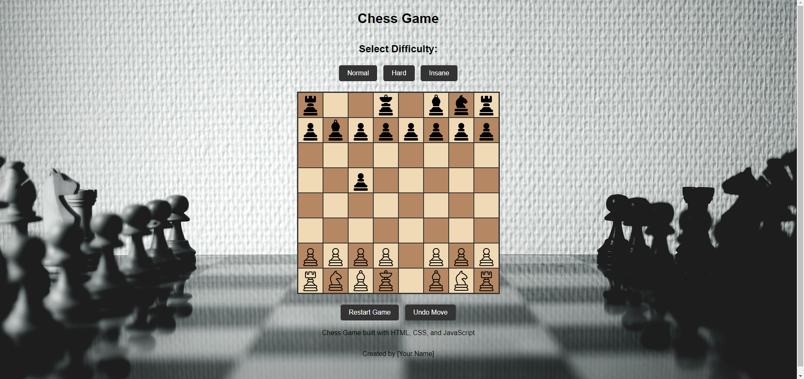

If you want to return to my normal readme, please click the link below:

[readme](../../README.md)

---

- [Testing](#testing)
  - [Full Device and Browser Testing](#full-device-and-browser-testing)
  - [Mobile Responsiveness Testing](#mobile-responsiveness-testing)
  - [Cross Browser Console Output Testing](#cross-browser-console-output-testing)
  - [Edge Case Testing](#edge-case-testing)
  - [Broken Links Testing](#broken-links-testing)
  - [Performance Testing](#performance-testing)
  - [Accessibility Testing](#accessibility-testing)
  - [Security Testing](#security-testing)
  - [User Experience (UX) Testing](#user-experience-ux-testing)
  - [Visual Regression Testing](#visual-regression-testing)
  - [Automated Testing](#automated-testing)
  - [Manual Testing](#manual-testing)
  - [Bugs](#bugs)
  - [Conclusion](#conclusion)

---

## Bugs

---

### 02/10/2024

- **Problem**: AI not responding after the initial move with the white piece.
- **Fix**: The issue was caused by incorrect handling of WebAssembly (WASM) files and miscommunication with Stockfish. The following steps were taken:

  1. Verified both the JavaScript wrapper (`stockfish-16.1-lite-single.js`) and WebAssembly file (`stockfish-16.1-lite-single.wasm`) were correctly placed in the `assets/js/` folder.
  2. Updated the initialization of the Web Worker to point to the JavaScript file:
     ```javascript
     const stockfish = new Worker("assets/js/stockfish-16.1-lite-single.js");
     ```
  3. Confirmed `.wasm` file loading via the Network tab and ensured the MIME type for `.wasm` was `application/wasm`.
  4. After correcting the Worker initialization, the AI responded as expected.

---

### 03/10/2024

- **Problem**: Unable to capture black pieces.
- **Fix**: The game logic was not handling piece capture correctly. Fixes included:

  1. Implemented logic to check if the target square is occupied by an opponent’s piece before a move is completed.
  2. Updated `handleSquareClick` to handle capturing correctly:
     ```javascript
     if (targetSquare.childElementCount > 0) {
       const targetPiece = targetSquare.querySelector(".piece");
       const targetColor = targetPiece.getAttribute("data-color");

       if (targetColor !== selectedPiece.color) {
         targetSquare.removeChild(targetPiece); // Capture opponent's piece
       } else {
         console.log("Cannot move to a square occupied by your own piece.");
         return;
       }
     }
     ```
  3. After this update, white pieces can now capture black pieces, and the game logic proceeds correctly.

---

### 04/10/2024

- **Problem**: No check, checkmate, or draw conditions detected.

  

- **Fix**:
  
  1. **`isKingInCheck`**: Added this function to determine if a player's king is under threat by any opponent's piece.
  2. **`findKing`**: This function locates the player's king for use in threat detection.
  3. **`canPieceAttack`**: Used to validate if a specific opponent piece can attack a target square, using helper functions for different movement types.
  4. **Pawn Attack Fix**: Ensured pawns only attack diagonally upwards (for white) and downwards (for black), preventing false positives.
  5. **`checkGameState`**: This function evaluates the game state after each move to check for check, checkmate, or safe kings.

- **Result**:
  The game now detects when a king is in check. Console logs show whether kings are in check or safe.

  

---

### 07/10/2024

- **Problem**: White pieces were not restricted to their specific movements, complicating debugging.
  
- **Fix**:
  1. **Movement Validation for All Pieces**: 
     - Implemented the `isValidPieceMove` function to validate movement for all pieces.
     - Movement restrictions based on official chess rules:
       - Pawns move forward, attack diagonally.
       - Rooks move horizontally/vertically.
       - Bishops move diagonally.
       - Knights move in an "L" shape.
       - Queens move like both rooks and bishops.
       - Kings move one square in any direction.
     - **Path Clearance Check**: Rooks, bishops, and queens must have a clear path to move. `isPathClear` was added to check this.
  
  2. **`handleSquareClick` Updates**: 
     - `isValidPieceMove` validates moves before they are completed.
     - The game now prevents illegal moves, flags invalid moves, and handles capturing of opponent pieces.
  
  3. **King Safety**:
     - `isKingMoveSafe` prevents the king from moving into positions where it would be in check.

- **Outcome**:
  The game now enforces movement restrictions for all pieces, aligning with chess rules. Debugging is easier as only valid moves are allowed.

  

---

### Next Steps:
- Continue refining movement logic to handle checkmate, stalemate, and castling.
- Test for special moves like en passant and pawn promotion.
